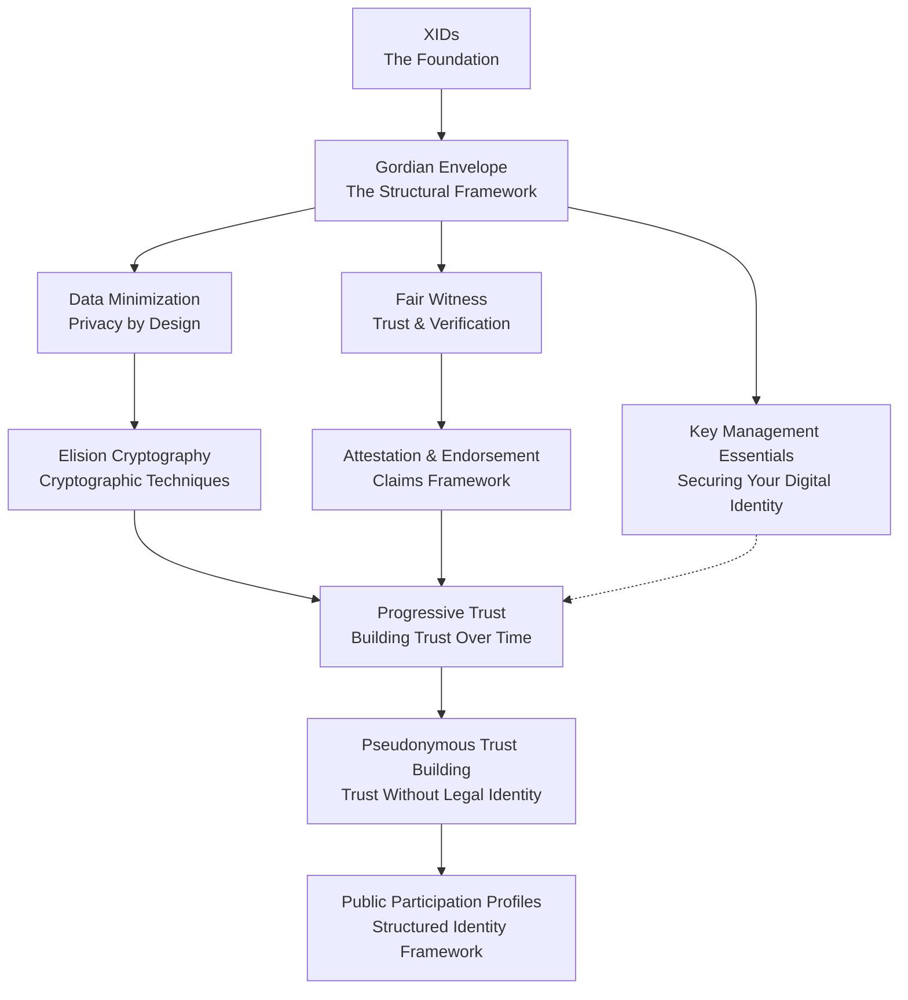

# XID Concepts: Understanding the Foundation

## What This Is & Why To Read It

This guide documents the conceptual foundation of eXtensible IDentifiers (XIDs) and the Gordian architecture. These concepts explain how XIDs work, why specific design choices were made, and how the components interact to create a privacy-preserving identity system.

### First Time Here?

XIDs (eXtensible IDentifiers) are 32-byte cryptographic identifiers derived from public keys. They provide:
- Stable identifiers that persist through key rotation and device changes
- Selective disclosure through cryptographic elision (removal of data while maintaining verifiability)
- Gradual trust building without requiring legal identity disclosure
- User control over identity data and disclosure decisions

This is experimental technology. The implementations continue to evolve as we explore the implications of elision-first design and progressive trust models.

Reading these concepts helps you:
- Understand the cryptographic and architectural principles before implementation
- Learn the privacy and security trade-offs in identity system design
- Contribute to the development of self-sovereign identity

Key topics covered:
- How XIDs maintain stable identifiers through key changes
- Cryptographic techniques for selective disclosure
- Trust building without identity revelation
- Practical identity management frameworks

## Quick Start Guide

**New to XIDs?** Start with these three essential concepts:
1. [XID](xid.md) - What XIDs are and why they matter (10 min)
2. [Gordian Envelope](gordian-envelope.md) - The data structure that makes it work (15 min)
3. [Data Minimization](data-minimization.md) - The privacy philosophy behind XIDs (10 min)

**Ready to implement?** Jump to [Tutorial 1: Creating Your First XID](../tutorials/01-your-first-xid/tutorial-01.md)

**Experienced developer?** Use the [Concept Map](#concept-map) to navigate directly to topics of interest.

## Table of Contents
- [Quick Start Guide](#quick-start-guide)
- [Introduction to XIDs and Gordian Architecture](#introduction-to-xids-and-gordian-architecture)
- [Core Concepts](#core-concepts)
- [Trust Model Concepts](#trust-model-concepts)
- [Privacy & Identity Concepts](#privacy--identity-concepts)
- [Concept Map](#concept-map)
- [Relating Concepts to Tutorials](#relating-concepts-to-tutorials)
- [Reading Approach](#reading-approach)
- [Questions to Consider](#questions-to-consider)
- [Next Steps](#next-steps)
- [Acknowledgments](#acknowledgments)

## Introduction to XIDs and Gordian Architecture

The XID-Quickstart tutorial introduces the Gordian architecture—a technology stack developed by Blockchain Commons that implements self-sovereign identity, data minimization, and progressive trust building.

The Gordian architecture includes:
- **XIDs** (eXtensible IDentifiers): Privacy-preserving digital identifiers
- **Gordian Envelopes**: Document format for selective disclosure
- **Cryptographic libraries**: Tools for security and verification

XIDs demonstrate how the Gordian architecture provides:
- **Self-sovereign identity**: User control over digital identity
- **Data minimization**: Sharing only necessary information
- **Progressive trust**: Building verifiable reputation over time
- **Key resilience**: Identity stability through key changes

These concepts explain how users control their digital identities while building verifiable reputation.

## Core Concepts

If you're new to XIDs and Gordian Envelopes, start with these fundamental concepts:

1. [XID](xid.md) - Understanding eXtensible IDentifiers
   - 32-byte cryptographic identifiers derived from public key hashes
   - Remain stable through key rotation, device changes, and recovery procedures
   - Enable consistent pseudonymous identity across time and contexts

2. [Gordian Envelope](gordian-envelope.md) - The data structure that powers XIDs
   - Structured data format using subject-predicate-object triples
   - Supports cryptographic signing, encryption, and selective disclosure
   - Maintains document verifiability after data removal

3. [Data Minimization](data-minimization.md) - Controlling information disclosure
   - Principle of sharing only necessary information for each interaction
   - Techniques for progressive disclosure as trust relationships develop
   - Methods to balance transparency requirements with privacy needs

4. [Elision Cryptography](elision-cryptography.md) - The cryptography of selective disclosure
   - Mathematical foundations for removing data while preserving integrity
   - Merkle trees and salted hashes prevent correlation of elided data
   - Enables partial document disclosure with cryptographic proof

## Trust Model Concepts

These concepts cover how trust is built, verified, and managed in a privacy-preserving environment:

1. [Fair Witness](fair-witness.md) - Making trustworthy assertions
   - Framework requiring transparency about context, methodology, and limitations
   - Explicit disclosure of potential biases and observational constraints
   - Applies to both self-attestations and peer endorsements

2. [Attestation & Endorsement Model](attestation-endorsement-model.md) - Framework for claims and verification
   - Self-attestations: structured claims about personal capabilities
   - Verifiable self-attestations: claims with independently checkable evidence
   - Peer endorsements: third-party verification requiring recipient acceptance

3. [Progressive Trust](progressive-trust.md) - Building trust incrementally over time
   - Ten-phase lifecycle from initial contact to sustained collaboration
   - Context-specific trust evaluations based on risk assessment
   - Restores human agency in trust decisions

4. [Pseudonymous Trust Building](pseudonymous-trust-building.md) - Building trust without revealing identity
   - Reputation building through cryptographic evidence commitments
   - Iterative trust lifecycles that expand based on demonstrated reliability
   - Peer endorsements that establish credibility without legal identity

## Privacy & Identity Concepts

These concepts explore additional aspects of privacy, identity, and key management:

1. [Public Participation Profiles](public-participation-profiles.md) - Managing public identity and reputation
   - Framework combining XIDs, attestations, and progressive trust concepts
   - Structured lifecycle for project participation with privacy preservation
   - Risk-based disclosure strategies for different contribution contexts

2. [Public Participation Profile Examples](public-participation-profile-examples.md) - Assertion taxonomy for trust levels
   - Preliminary taxonomy of assertions for participation contexts
   - Progressive disclosure patterns from anonymous to identified participation
   - Note: Contains draft material requiring domain expert review

3. [Key Management Essentials](key-management.md) - Securing and managing cryptographic keys
   - Trust-based key hierarchies with progressive permission models
   - Key rotation strategies that maintain XID stability
   - Recovery procedures that preserve identity continuity

## Concept Map

The following diagram shows how these concepts relate to each other in a progressive learning journey:

## Relating Concepts to Tutorials

Each tutorial builds on specific concepts. Here's how they align:

- **Tutorial 1**: [Creating Your First XID](../tutorials/01-your-first-xid/tutorial-01.md)
  - **Primary concepts**: [XID](xid.md), [Gordian Envelope](gordian-envelope.md)
  - **What you'll learn**: Create and manage your first cryptographic identity
  - **Why it matters**: Foundation for all subsequent work with XIDs

- **Tutorial 2**: [Understanding XID Structure](../tutorials/02-understanding-xid-structure.md)
  - **Primary concepts**: [Gordian Envelope](gordian-envelope.md), [Data Minimization](data-minimization.md), [Elision Cryptography](elision-cryptography.md)
  - **What you'll learn**: Internal structure of XIDs and selective information disclosure
  - **Why it matters**: Enables privacy-preserving sharing of identity information

- **Tutorial 3**: [Self-Attestation with XIDs](../tutorials/03-self-attestation-with-xids.md)
  - **Primary concepts**: [Fair Witness](fair-witness.md), [Attestation & Endorsement Model](attestation-endorsement-model.md)
  - **Secondary concepts**: [Pseudonymous Trust Building](pseudonymous-trust-building.md)
  - **What you'll learn**: Creating verifiable claims about your skills and experiences
  - **Why it matters**: Foundation for building verifiable reputation

- **Tutorial 4**: [Peer Endorsement with XIDs](../tutorials/04-peer-endorsement-with-xids.md)
  - **Primary concepts**: [Attestation & Endorsement Model](attestation-endorsement-model.md), [Progressive Trust](progressive-trust.md)
  - **Secondary concepts**: [Fair Witness](fair-witness.md)
  - **What you'll learn**: Building trust through third-party verifications
  - **Why it matters**: Strengthens credibility through independent validation

- **Tutorial 5**: [Key Management with XIDs](../tutorials/05-key-management-with-xids.md)
  - **Primary concepts**: [Key Management Essentials](key-management.md)
  - **Secondary concepts**: [Progressive Trust](progressive-trust.md), [Public Participation Profiles](public-participation-profiles.md)
  - **What you'll learn**: Secure key management strategies and progressive permissions
  - **Why it matters**: Ensures long-term identity stability and security

## Reading Approach

Choose the approach that best matches your learning style:

1. **Concept First** (Recommended for beginners)
   - Read concept documents before trying related tutorials
   - Builds theoretical understanding before practical application
   - Best for those who prefer to understand "why" before "how"

2. **Practice First** (Recommended for hands-on learners)
   - Complete tutorials, then read concepts to deepen understanding
   - Uses concrete experience as foundation for abstract concepts
   - Best for those who learn by doing

3. **Reference Approach** (For experienced developers)
   - Use concept documents when you need to clarify something
   - Target specific concepts relevant to your current needs
   - Best for those with some background knowledge

4. **Comprehensive Approach** (For thorough understanding)
   - Read all concepts first, then do all tutorials in sequence
   - Provides complete theoretical framework before any practice
   - Best for those who prefer systematic, structured learning

## Questions to Consider

As you explore these concepts, consider:

1. **Real-world application**: How does this concept address current trust and identity challenges?
   - How do traditional identity systems fall short?
   - What privacy problems could this solve?

2. **Comparative advantages**: What problems does this approach solve compared to traditional methods?
   - How does selective disclosure improve on all-or-nothing sharing?
   - What trust issues does cryptographic verification address?

3. **Implementation ideas**: How could you apply these concepts to your own projects?
   - What specific use cases in your domain could benefit?
   - How would you adapt these concepts for your particular needs?

4. **Design trade-offs**: What are the balances between security, privacy, and usability?
   - How do different choices affect these three factors?
   - Where would you make different trade-offs for specific contexts?

5. **Integrated framework**: How do these concepts create a comprehensive trust system?
   - How do the technical and social concepts complement each other?
   - Where do you see interdependencies between different concepts?

## Next Steps

After exploring these concepts, you're ready to:

- Follow the [Learning Path](../LEARNING_PATH.md) for a structured journey
- Work through the [Tutorials](../tutorials/) for hands-on implementation
- Experiment with the [Examples](../examples/) to see practical applications
- Apply these concepts to your own digital identity challenges
- Join the [GitHub discussions](https://github.com/BlockchainCommons/XID-Quickstart/discussions) to share your insights and questions
- Explore other [Blockchain Commons projects](https://www.blockchaincommons.com/projects.html) that implement these principles

## Acknowledgments

This concepts guide represents collaborative work within the Blockchain Commons community:

- **Initial concepts and framework**: Christopher Allen (@ChristopherA)
- **Extensive review and updates**: Shannon Appelcline (@shannona)
- **Testing and validation**: All examples tested against bc-envelope-cli v0.18.0

The concepts have evolved through community feedback and practical implementation experience. We welcome continued contributions to refine and expand these ideas.
